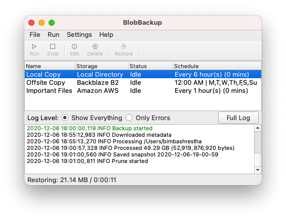

# BlobBackup Documentation

Welcome to the BlobBackup Documentation. If you find something
confusing, missing or wrong, please file an issue on our 
[Github](https://github.com/bimbashrestha/blobbackup) page! 

## What is BlobBackup?

BlobBackup is a desktop application for your Windows, Mac or Linux 
computer that lets you create encrypted, incremental, and highly space 
efficient backups to any storage of your choice while being 
extermely easy to use. 

BlobBackup has built-in scheduling, cloud suport, highly efficient 
data de-duplication, compression, end to end encryption, file history 
and much more. Everything you need to sleep better at night knowing 
your data is protected is packaged into one neat, minimalist app.

## Other Backup Programs

BlobBackup takes inspiration from a number of other wonderful backup
tools and hopes to combine many of their best aspects. Backup 
tools that were studied in the building of BlobBackup include:
[Restic](https://github.com/restic/restic), 
[Vorta/Borg](https://github.com/borgbackup/borg),
[Duplicati](https://github.com/duplicati/duplicati) and
[Duplicacy](https://github.com/gilbertchen/duplicacy). Have a look at 
the [Data Format page](format.md) of the documentation if you're interested 
in the internals. 

Note: eventually, I'd like to do a comparison of sorts between the tools 
listed above and BlobBackup...eventually:)

## Frequently Asked Questions

### Can I use BlobBackup for Free?

Yes! BlobBackup is licensed under GPLv3 and hence FOSS (Free and Open Source).

### What Storage Providers does BlobBackup support?

BlobBackup supports Local, Network and most major cloud storage providers. You 
can check out the [backup page](backup.md) to see what is currently suported. 
New storages will be added based on user demand and I'm looking into an 
[Rclone](https://rclone.org) integration as well. 

### Are Concurrent Backups Supported?

So BlobBackup runs a `prune` operation after every backup operation to clean 
up any orphan chunks in the repository. This means that for concurrent backups
to work, backups and deletions should be allowed to run concurrently. 

While the data format lends itself well to lock free operations, lock free 
deletion has not been implemented yet. So for the time being, concurrent 
backups are not possible.
